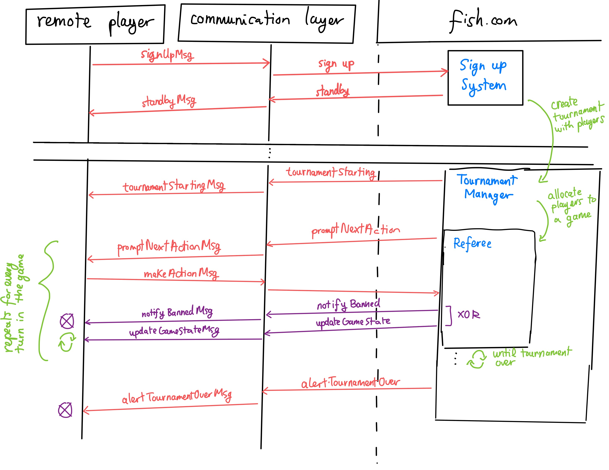

# Fish Remote Protocol

## Logical Interaction Diagram



### Message specifications

`signUpMsg`

```typescript
// the ID that the player wishes to be identified with in the tournament
string
```

`standbyMsg`:

```typescript
"standby"
```

`tournamentStartingMsg`:

```typescript
"starting"
```

`promptNextActionMsg`:

```typescript
["action", state]

// state
{
    phase: "placement" | "playing"
    state: {
        // players in the order in which they play
        players: Player[]
        // Each number is between 0-5, where 0 represents a hole
        board: Number[][]
    }
}

// Position
[Nat, Nat]

// player
{
    color: "red" | "black" | "brown" | "white"
    score: Nat
    places: Position[]
}
```

`makeActionMsg`:

```typescript
;[Position]
// OR
;[Position, Position]
```

`notifyBannedMsg`:

```typescript
// string explains the reason why the player was banned
;["banned", string]
```

`updateGameStateMsg`:

```typescript
;["update", state]
```

`alertTournamentOverMsg`:

```typescript
// boolean represents if the player has won
;["over", boolean]
```

## English Prose

The remote player can sign up by sending a `signUpMsg`. The communication layer then designates it to
the signup system tells the communication layer to inform the player to standby. To do this the
communication layer sends the player a `standbyMsg`.

Once it is time to start the tournament, the sign up system creates a tournament manager with all
signed up players. The tournament manager uses the communication layer to send out a
`tournamentStartingMsg` which tells the players that the tournament is starting.

From there, the tournament manager splits players into games by allocating them to referees.
When it is the player's turn (the diagram assumes that player goes first), the referee will
tell the communication layer to request an action from the player. The communication layer
will send a `promptNextAction` message. The player will return a `makeActionMsg` if the game is in
the placement phase then this should be the position to place a penguin, if the game is in the playing phase
then the player should send an array of two position representing the position being moved from
and the position being moved to. The communication layer will wait for this action, and then pass
the desired action to the referee.

If the action is successful, the referee tell the communication to send an `updateGameStateMsg` with a json representation
of the new game state for each player in the game. If the action is unsuccessful the referee will tell the communication
layer to notify the player that it has been banned. After a player is banned, the communication between the player and the
communication layer is shut down.

The player will receive an `updateGameStateMsg` for each other player's turn (following the same protocol). This
sequence of prompting an action, making an action, and updating the game state will repeat until the game is over.

Once the game is over, the tournament manager will continue allocating players to games, and the communication
with the referee will repeat until there are no possible games to play.

Once the tournament is over the tournament manager tells the communication layer to send the players
a `alertTournamentOverMsg` which lets the players know that the tournament is over and if they
have won.

If at any point in this protocol a player takes too long to respond or if the connection between the
communication layer and the player closes, the communication layer will shut down and the player will be removed
from the tournament
