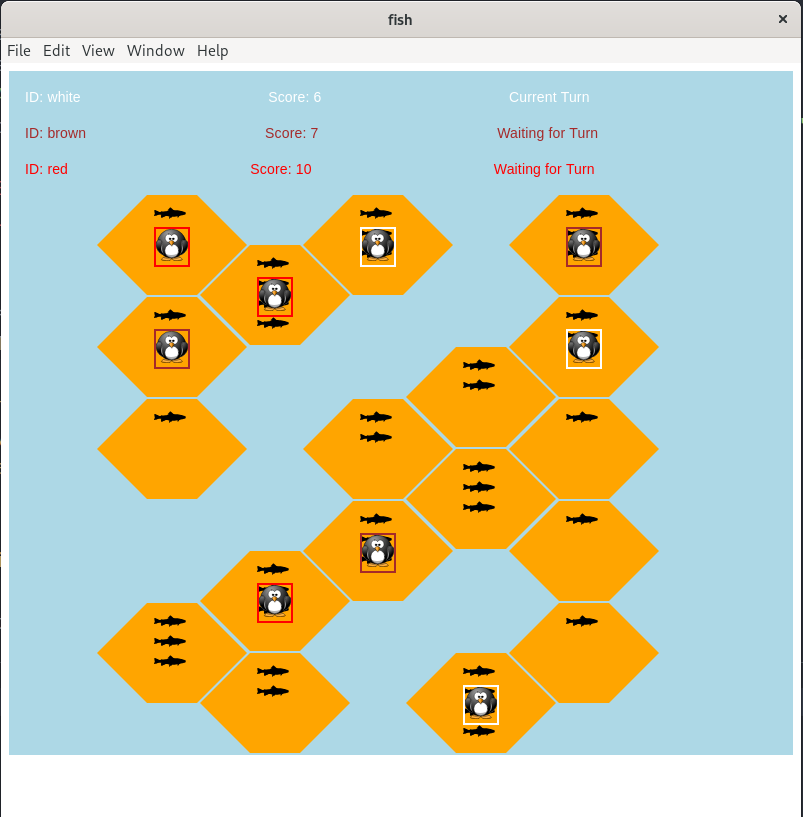

# FishGame
> CS4500 Project from Fall 2020

Player, Referee and Tournament Manager for a multiplayer online version of
[Hey, That's My Fish!](https://boardgamegeek.com/boardgame/8203/hey-s-my-fish).
Implemented using TypeScript (v4.2).

